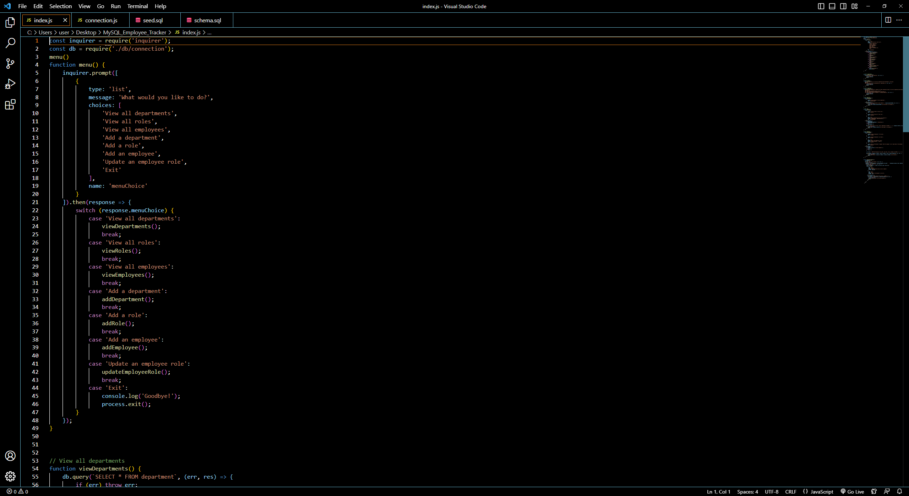
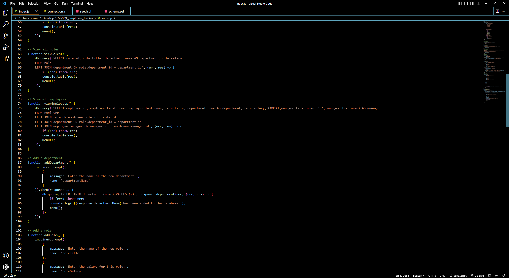
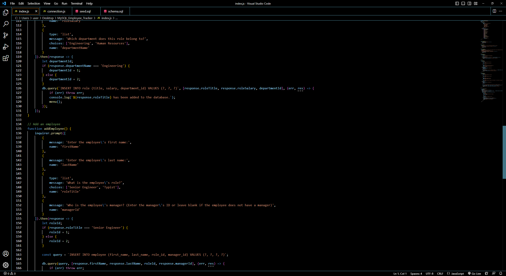
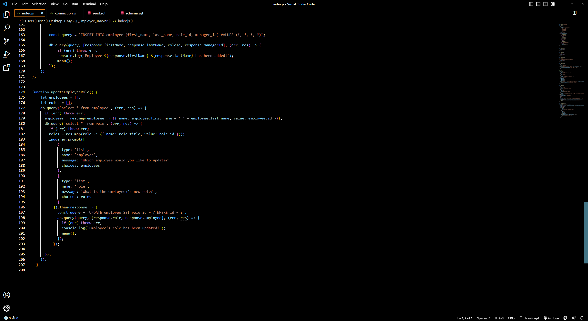
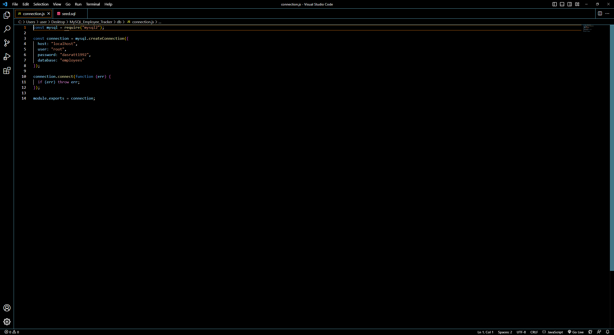
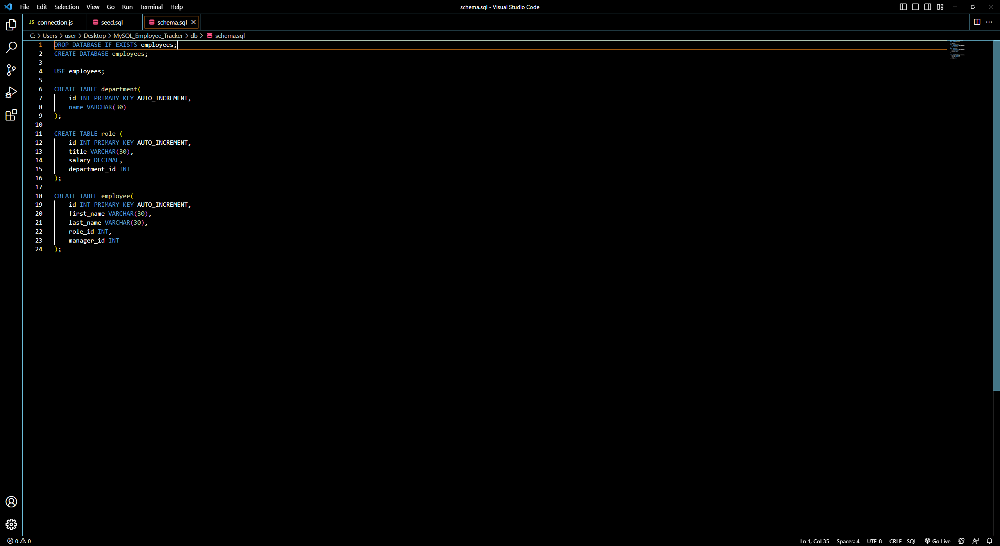
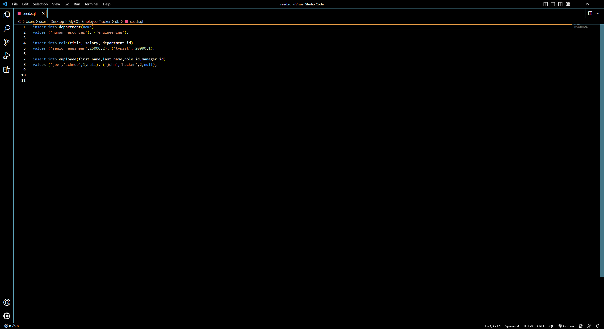

# MySQL_Employee_Tracker
This Repository contains code that will be able to manage a company's employee database. The project is a command line application that will be used to manage a company's employee database, using Node.js, Inquirer and MySQL. Upon running the application in the command line the user will be met with several options, choosing to either view all Departments, Roles and/or Employees, or to add and update those options. The information entered in the command line will be displayed on rows to the console by using the console.takble package.

# Images

# Links 

Github Repository : https://github.com/Ervin543/MySQL_Employee_Tracker

Walkthrough Video : https://drive.google.com/file/d/1zHrDFY1Yrn4D0jGU-9FOFzECYPhFymHj/view
